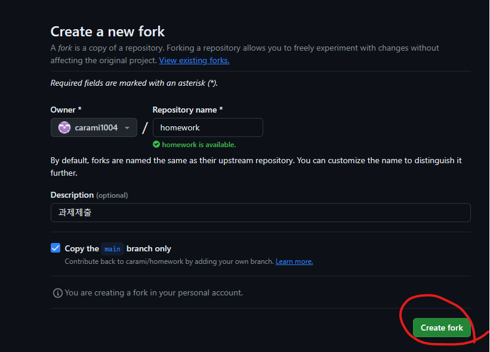
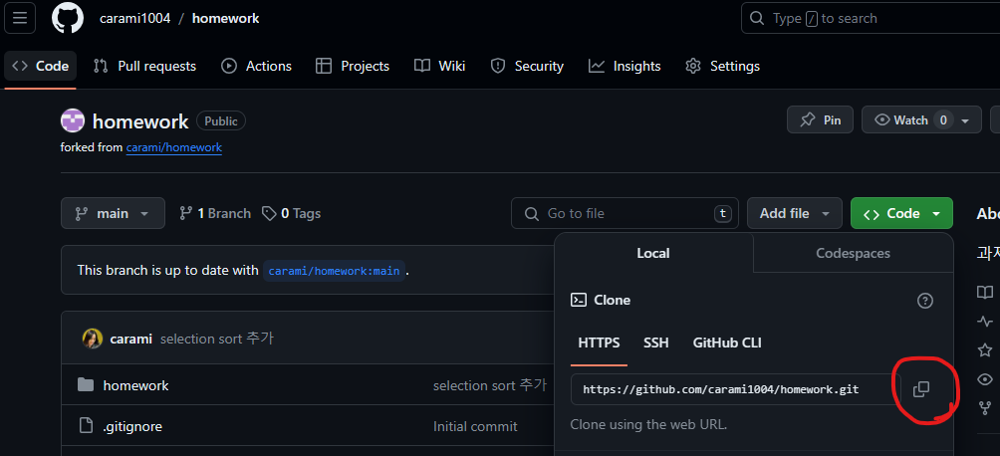

# 과제제출 가이드

--

### 1. 프로젝트 Fork

> 교육생들은 해당 저장소에 쓰기 권한을 가지고 있지 않으므로 구현한 코드를 추가 할 수 없습니다.

> 각자 계정으로 Fork 합니다. Fork는 해당 저장소를 자신의 계정으로 복사합니다.

- github에 본인 계정으로 로그인 합니다.

- 제공받은 저장소로 이동합니다.

- 아래 이미지와 같이 우측 상단의 Fork 버튼을 클릭합니다.
  

- 자신의 계정에서 create fork 합니다.
  

---

### 2. fork한 저장소를 로컬 컴퓨터로 clone

> github 에는 fork 한 저장소가 생겼지만, 자신의 로컬컴퓨터에는 존재하지 않습니다.

- clone 명령을 이용하여 fork 한 저장소를 자신의 컴퓨터에 복사합니다.

> 그림에서 Copy url to clipboard 버튼을 클릭해서 복사한 주소를 git clone 명령 다음에 붙혀넣기 합니다.
> 

- 로컬컴퓨터에 코드를 저장할 적당한 위치의 터미널 (cmd, git bash)에서 아래 명령을 수행합니다.

```
    git clone https://github.com/carami1004/homework.git
```

> clone 한 저장소 폴더가 명령을 수행한 디렉토리 하위에 생성됩니다.

- 클론한 폴더로 이동합니다.

```
    cd {저장소 아이디}
    cd homework
```

---

### 3. 브랜치 생성

> git은 서로 다른 작업을 할 수 있도록 브랜치를 제공합니다.

- 터미널에서 브랜치를 생성합니다.

> switch는 브랜치를 이동하는 명령인데 -c 옵션을 이용하면 새로운 브랜치를 생성후 생성된 브랜치로 이동합니다.

```
    git switch -c 브랜치명

    git switch -c carami_homework_1
```

### 4. IntelliJ로 가져오기

> 숙제를 수행하기 위한 저장소를 IDE로 가져옵니다. 우리과정은 IntelliJ 를 사용합니다.

### 5. 구현 및 commit, push

> 과제의 요구사항을 잘 파악하여 과제를 해결합니다.

> 완료되면 로컬 저장소에 저장합니다.

```
git add .  //git add 파일명   원하는 파일만 추가.
git commit -m "메시지"  //커밋메시지를 작성해서 로컬저장소에 커밋합니다.
```

> 원격 저장소( github )에 올립니다.

```
git push origin 브랜치이름
ex) git push origin carami_homework_1
```

### 6. github 에서 Pull Request를 보냅니다.

> Pull Request 는 github에서 제공하는 기능으로 코드리뷰 요청을 보낼 때 사용합니다.
